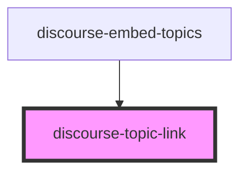

# discourse-topic-link

<!-- Auto Generated Below -->

## Properties

| Property     | Attribute    | Description | Type              | Default          |
| ------------ | ------------ | ----------- | ----------------- | ---------------- |
| `newWindow`  | `new-window` |             | `boolean`         | `true`           |
| `noopener`   | `noopener`   |             | `boolean`         | `this.newWindow` |
| `noreferrer` | `noreferrer` |             | `boolean`         | `this.newWindow` |
| `topic`      | --           |             | `IDiscourseTopic` | `undefined`      |

## Dependencies

### Used by

 - [discourse-embed-topics](../discourse-embed-topics)

### Graph

----------------------------------------------

*Built with [StencilJS](https://stenciljs.com/)*
